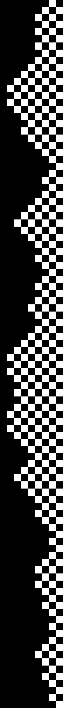

Built this simple program to get a better feeling on how to structure a Haskell executable project and interacting with 
some real libraries. 

This one implements a first order Markov chain that I can use to:
    * Generate patterned images with the `JuicyPixels` library
    * Building paragraphs from input text.

